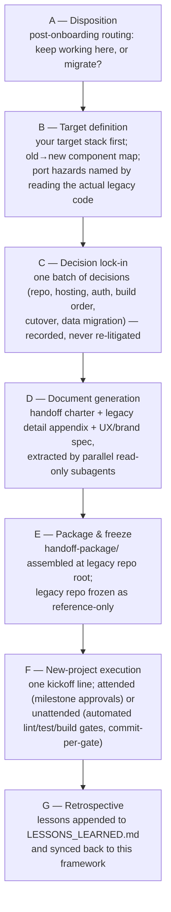

# AI Onboarding Framework

**A battle-tested protocol for putting AI agents to work on real codebases — including a complete legacy-to-new-stack migration pipeline — without drift, hallucinated context, or wrecked rebuilds.**

## The problem

AI coding agents fail in predictable ways on serious work:

- They **drift**: scope, architecture, and priorities quietly mutate over a long session until the output no longer matches the ask.
- They **hallucinate context**: instead of reading the code, they pattern-match on what similar projects usually look like — deadly on legacy systems full of accumulated business rules.
- They **wreck legacy rebuilds**: a rewrite driven by vibes loses the endpoint nobody remembered, the import parser's load-bearing bug, and the lifecycle hook that stamped every record.

This framework fixes that with evidence-backed onboarding, explicit readiness scores, mandatory drift audits, and hard gates between alignment, planning, and implementation. Nothing gets built until the agent has proven — with scored, auditable artifacts — that it actually understands the system.

## Headline feature: the Legacy Migration Workflow

Most AI-agent frameworks stop at "onboard and plan." This one ships a complete, **validated-on-a-real-production-migration** pipeline for rebuilding a legacy system on a new stack (Phases A–G):



What makes it different:

- **The handoff is a package, not a prayer.** Phase D generates three documents — a project charter, a legacy detail appendix (every endpoint, the consolidated schema, every lifecycle hook, byte-level file-format contracts, dependency *intent* map), and a UX/brand spec (design tokens, nav trees, exact table columns per view) — so the new project's AI almost never needs the legacy repo.
- **The legacy repo gets frozen**, not abandoned: committed, artifacts force-added, and kept as a read-only behavioral reference.
- **Unattended execution actually works.** The package ships runner permission config and command-shape rules that eliminate the tool-approval stalls that kill "autonomous" runs — learned the hard way and baked in (see `docs/LESSONS_LEARNED.md`).
- **Every run makes the next one better.** Phase G appends real friction→fix entries to a living lessons log that the next migration reads first.

Full detail: `docs/protocols/POST_ONBOARDING_MIGRATION_PLAYBOOK.md`.

## Why this exists

This framework wasn't designed on a whiteboard — it was extracted from real AI-assisted delivery work and dogfooded on real projects: a production timecard system, a content-analysis SaaS, and a full legacy migration of a production line-of-business system (Laravel 7/Vue 2 → Node 20/Express/Prisma/Vue 3). Every rule in `docs/LESSONS_LEARNED.md` traces to a specific failure that cost real time, and the fix is now baked into the templates and playbook.

## What's in the box

- **Adaptive onboarding** with a low question budget: evidence-backed context generation for brownfield and greenfield projects, with capability profiles and platform detection.
- **Domain profile registry**: pluggable brownfield overlays keyed off repo evidence. `software-brownfield` is active today; `cybersecurity-brownfield`, `data-brownfield`, and `ops-brownfield` are registered but planned (no artifact yet) — see `profiles/PROFILE_REGISTRY.md`.
- **Readiness gates**: work is scored; standard execution requires `>=90`, high-impact work `>=92` with drift `none`. Below threshold, implementation is blocked — no exceptions.
- **Drift audits**: mandatory self-critique on a cadence, with `major` drift halting all progression.
- **Strict command mode**: `cmd:`-prefixed shortcuts (`cmd:onboard`, `cmd:plan:`, `cmd:impl`, `cmd:drift-audit`, `cmd:reanchor`) that never hijack normal conversation.
- **The Legacy Migration Workflow** above, as an opt-in continuation of brownfield onboarding.

---

## Where To Start

Create a folder in the root directory of your project called `/ai-onboarding`.

Download and copy contents of this repo to the `/ai-onboarding` folder before starting.

Use command shortcuts for the fastest workflow. To avoid accidental triggering, a shortcut is only treated as a command when your message starts with `cmd:` (for example, `cmd:onboard` or `cmd:plan: <task description>`). If you use words like `onboard` in normal conversation, they are treated as regular text.

Command reference:

- `commands/COMMANDS.md` (copy/paste view)
- `commands/commands.yaml` (source of truth)

In a fresh project/session, start with this first message so the assistant loads your local command spec before shortcuts:

```text
Read /ai-onboarding/commands/commands.yaml and enforce strict command mode only for messages that begin with `cmd:`.
Do not reject or reroute normal-language requests that do not begin with `cmd:`; handle them as normal conversation.
```

Then use this command sequence:

1. `cmd:onboard`
2. `cmd:drift-audit`
3. `cmd:plan: <task description>`
4. `cmd:impl`

After a brownfield `cmd:onboard` completes, the assistant asks one non-blocking routing question: **keep working here** (continue to `cmd:plan:`) or **migrate** (rebuild on a new stack via the optional Legacy Migration Workflow above). Answering is deferrable; it never blocks onboarding completion.

If you are starting a new thread on a project that has already been onboarded, start with:

1. `cmd:reanchor`
2. `cmd:plan: <task description>` or ask your normal-language question

Use `cmd:onboard` again only when the project needs a fresh onboarding run or the context has materially changed.

If you prefer raw prompts instead of commands, send these prompts in order.

### 1) Alignment (start here)

```text
Follow /ai-onboarding/docs/protocols/ARCHITECTURE_ALIGNMENT.md.
No implementation changes.
```

After this first message, the assistant must ask for missing Step 0 inputs automatically.
You should not need to provide them in advance.
Step 0 required fields are a hard gate: the assistant must not proceed to Step 1+ until all required fields are provided.

Expected assistant behavior:

- Ask one question at a time (sequential), not a large multi-field block.
- Use canonical Step 0 question wording from `/ai-onboarding/commands/STEP0_CANONICAL_OPTIONS.md` verbatim.
- Ask mode first with plain-language definitions:
1) greenfield = new project/idea with little or no implementation yet
2) brownfield = existing repo/system that already has implementation
- Ask platform and platform model/version every run (auto-detection can prefill but must still be confirmed or corrected).
- Ask capability profile as a numeric choice:
1) Auto-detect, 2) Locked-down, 3) Standard, 4) High-trust, 5) All-access.
- If `greenfield`, continue with greenfield-relevant questions.
- If `brownfield`, ask target workspace path and project brief next.
- After Step 0, run guided intake questions before generating output files:
- If `greenfield`, ask (one question at a time):
- project brief (2-3 sentences: what is being built, for whom, target platform)
- first milestone outcomes (up to 3 bullets)
- hard constraints (timeline/budget/tech/compliance; `none` allowed)
- If `brownfield`, ask (one question at a time):
- do-not-break boundaries (security/data/runtime/deploy)
- Then auto-fill onboarding defaults:
constraints = no destructive actions, no secrets in outputs, no implementation during onboarding.
approvals = approved plan before implementation; drift `major` blocks progression.
success criteria = required artifacts generated; score threshold met; drift not `major`.
- Scope boundaries are auto-filled by default:
in scope = onboarding artifacts + readiness/drift gates.
out of scope = implementation/deployment/refactors.
- Optional override prompt:
"Optional: keep defaults, or type override to customize constraints/approvals/success criteria/scope/special-focus."
- If user types `override`, ask one area at a time in this order:
constraints -> approvals -> success criteria -> scope -> special focus.
- `keep defaults` only applies to defaults/override values; it does not skip guided intake questions.
- Before generating artifacts, ask one final non-blocking checkpoint:
"Any final context to include before I generate artifacts? Reply `none` to continue, or add up to 3 bullets."
- Optional fields (`execution role profile`, `profile override`) are non-blocking.

If execution role profile is omitted, the default role from `AGENT_RULES.md` is used.

Strict behavior:

- Missing required Step 0 fields block onboarding progression.
- The assistant asks only missing required fields and pauses until answered.
- The assistant does not infer missing Step 0 values.
- If capability choice is unclear, the assistant defaults to `1` and confirms.
- After Step 0, guided intake answers must be captured before artifact generation begins.

Wait for:

- onboarding output artifacts
- alignment confirmation
- risks/ambiguities

### 2) Drift Audit Gate

```text
Run mandatory self-critique and drift audit.
Generate /ai-onboarding/output/DRIFT_CHECK_REPORT.md.
Use /ai-onboarding/templates/DRIFT_CHECK_TEMPLATE.md as the report format.
If drift is major, pause and ask for clarification.
No implementation changes.
```

Drift audit cadence during active development:

- Run `cmd:drift-audit` every 3-5 working days while work is active.
- Run `cmd:drift-audit` immediately after material scope/architecture/priority changes.
- Run `cmd:reanchor` for quick alignment checks between full drift audits.

### 3) Change Planning

Command shortcut form:

- `cmd:plan: <task description>`

```text
Follow /ai-onboarding/AGENT_RULES.md.

Begin Phase 2 - Change Planning only.
No implementation changes.

Task:
[Clearly describe the task here]
```

Review and explicitly approve the plan before implementation.

### 4) Implementation

```text
Follow /ai-onboarding/AGENT_RULES.md.

Proceed with implementation according to the approved Change Plan.
```

### 5) Mid-Thread Re-Anchor (optional)

```text
Follow /ai-onboarding/AGENT_RULES.md.

Perform a quick re-alignment check against /ai-onboarding/output/MASTER_CONTEXT.md and /ai-onboarding/output/AI_ONBOARDING_SUMMARY.md.
Do NOT regenerate onboarding output in this message.
No implementation changes in this message - alignment only.

Then continue from the already-approved Change Plan.
```

For full details, use `docs/protocols/AI_EXECUTION_PROTOCOL.md`.

## Core Files

- `docs/protocols/AI_EXECUTION_PROTOCOL.md`: exact phase prompts
- `docs/protocols/ARCHITECTURE_ALIGNMENT.md`: Phase 1 alignment rules
- `AGENT_RULES.md`: behavioral constraints and readiness gates
- `docs/protocols/AI_AGENT_BOOTSTRAP_AND_ARCHITECTURAL_COMPREHENSION_CONTRACT.md`: mandatory onboarding contract
- `docs/generators/AI_ONBOARDING_MASTER_CONTEXT_GENERATOR.md`: master context generation rules
- `templates/ONBOARDING_INTAKE_TEMPLATE.md`: low-friction intake template
- `templates/DRIFT_CHECK_TEMPLATE.md`: standard drift audit template
- `commands/COMMANDS.md`: command copy/paste prompts
- `commands/commands.yaml`: command source-of-truth
- `profiles/PROFILE_SELECTION_PROTOCOL.md`: deterministic brownfield profile router
- `profiles/PROFILE_REGISTRY.md`: active/planned profile registry
- `profiles/greenfield/GREENFIELD_MASTER_CONTEXT_ARTIFACT.md`: high-rigor greenfield depth overlay
- `docs/protocols/POST_ONBOARDING_MIGRATION_PLAYBOOK.md`: optional legacy-to-new-stack migration workflow (Phases A–G)
- `templates/HANDOFF_TEMPLATE.md`: rebuild handoff document template (project-agnostic; stack-first; includes unattended mode)
- `templates/handoff-package-skeleton/`: layout + runner permission config + command rules for the package carried to the new project
- `docs/LESSONS_LEARNED.md`: living friction→fix log from real migration runs (read before each migration; update during/after — Playbook Phase G)

## Legacy Migration Workflow (Optional)

Onboarding does not imply migration — most brownfield runs continue into normal change planning (`cmd:plan:`). But if, after onboarding, the decision is to **rebuild the system on a new stack**, the Phase A–G workflow described at the top of this README is available:

- `docs/protocols/POST_ONBOARDING_MIGRATION_PLAYBOOK.md` (Phases A–G)

Before using it, read `docs/LESSONS_LEARNED.md` — a living friction→fix log from real migration runs, updated during/after each run (Phase G).

The package's `claude/` folder ships a runner permission allowlist and command-shape rules that eliminate tool-approval stalls during unattended runs (see `templates/handoff-package-skeleton/`).

## Software Brownfield Overlay

The only active domain profile today (`cybersecurity-brownfield`, `data-brownfield`, `ops-brownfield` are registered as planned in `profiles/PROFILE_REGISTRY.md` but have no artifact yet).

When mode is `brownfield` and target workspace is an existing software project, apply:

- `profiles/software-brownfield/SOFTWARE_BROWNFIELD_MASTER_CONTEXT_ARTIFACT.md`

Direct prompt variant:

- `profiles/software-brownfield/SOFTWARE_BROWNFIELD_COPYPASTE_PROMPT.md`

Profile selection behavior:

- For brownfield runs, profile selection is resolved via `profiles/PROFILE_SELECTION_PROTOCOL.md`.
- If ambiguous, one disambiguation question is asked within onboarding budget.

## Greenfield Overlay

When mode is `greenfield`, apply:

- `profiles/greenfield/GREENFIELD_MASTER_CONTEXT_ARTIFACT.md`

## Output Artifacts

All generated artifacts are written to:

- `/ai-onboarding/output`
- This directory is auto-created if missing.
- Generated files in `output/` are gitignored; only `output/.gitkeep` is tracked.

Common files:

- `MASTER_CONTEXT.md`
- `AI_ONBOARDING_SUMMARY.md`
- `ASSUMPTIONS_LEDGER.md`
- `DRIFT_CHECK_REPORT.md`
- `PROJECT_SCOPE.md` (greenfield required)
- `ONBOARDING_INTAKE_FILLED.md`

Migration workflow files (only when the Legacy Migration Workflow is used):

- `NEW_PROJECT_HANDOFF.md` (charter for the new project)
- `LEGACY_DETAIL_APPENDIX.md` (implementation-level spec)
- `UX_BRAND_SPEC.md` (visual contract incl. table columns per view)
- plus an assembled `handoff-package/` at the legacy repo root (docs + runner config + brand assets)

Archived output snapshots:

- `/ai-onboarding/output/archive/*`

## Role Persistence

- Optional Step 0 field: `Execution role profile` in format `domain - role`.
- If provided, it is persisted in onboarding artifacts (starting with `ONBOARDING_INTAKE_FILLED.md`) and carried forward in alignment context.
- If omitted, the default role from `AGENT_RULES.md` is used.
- Precedence order: current prompt role profile -> persisted onboarding artifacts -> default role in `AGENT_RULES.md`.

## Readiness Gates

- Standard-risk execution: onboarding score `>=90` and drift not `major`
- Score `85-89`: low-risk prep only
- High-impact work: onboarding score `>=92` (target `95`) and drift `none`
- Any `major` drift: implementation blocked

## Recommended First Live Pilot

1. Run one brownfield onboarding against a non-production project folder.
2. Review `MASTER_CONTEXT.md` and `DRIFT_CHECK_REPORT.md`.
3. Approve Phase 2 plan.
4. Re-run pre-implementation drift check before any changes.

---

Built by [Basil Barnaby](https://github.com/BasilBarnabyCa) · [Grafite AI](https://grafite.ai) — AI-enablement consulting, with AI-accelerated legacy migration as the flagship offer. This framework is free to use (MIT); if you want it run *for* you, [get in touch](https://grafite.ai).
